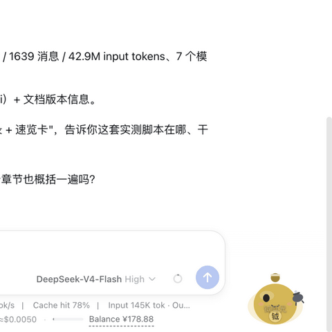

# @weibaohui/dsh-xiuxian

[](https://github.com/topics/dsh-plugin)
[](https://www.npmjs.com/package/@weibaohui/dsh-xiuxian)

**修仙陪伴插件**：随机唤醒一位《凡人修仙传》角色，化作 Q 版电子宠物悬浮在屏幕角落，用TA的口吻、经历与法宝陪你写代码。



## 事件联动（v0.4.0）

宠物通过 `session/event` 订阅真实会话事件流，按消息类型做出不同说话与动作：

| 会话事件 | 宠物反应 |
|---|---|
| 道友发送消息 | 蹦跳 + 「道友发问」凝神细听 |
| agent 调用工具 | 【施法】御剑术(Bash)/天眼术(Read)/搜魂大法(Grep)/身外化身(子代理)…附真实命令 |
| 大模型流式返回 | 【心声道】打字机气泡逐句显示回答 |
| 工具报错 | 抖动 + 【天劫雷音】"轰然炸响！道友莫慌" |
| 回合完成 | 【功行圆满】"道果+1" |

可用 🎬 按钮一键开关联动。

## 核心功能

- **随机唤醒**：每个新会话自动加权随机一位角色（主要角色权重更高），侧栏按钮直接显示TA的名字
- **专属 Q 版形象**：特征驱动引擎程序化生成——九类形态（修士/女修/老者/孩童/僧人/妖兽/灵虫/傀儡/鬼魂）× 十四系配色（青竹蜂云剑→青、朱雀环→朱红、墨大夫→玄黑）× 十三类法宝（身份持什么就捧什么）；圣祖古魔自动长犄角
- **指点一二**：按编码情境用角色**原话语录**点评——构建=【开炉炼丹】失败"炸炉了！"、测试全绿="丹成上品！"、提交=【凝结道果】、报错=【天劫雷音】
- **复制技能**：一键复制该角色 4000+ 字的对话 system prompt，贴进任意会话即让角色"上身"，以TA的口吻、经历、思想与你对话
- **话术上身**：复制修行话术提示词，让 agent 会话本身用法术腔播报干活（御剑术执行命令、搜魂大法检索代码、身外化身派出子代理）
- **生平玉简**：浮层内直接翻阅此人一生的分卷年表（从第 1 章到第 2451 章）
- **打坐周期**：开启后宠物闭眼入定，每 25 分钟以角色口吻催你起身活动
- **小巧气泡 + 透明度**：紧凑气泡（v0.5.0 瘦身 25%），透明度滑杆实时调节并持久化周天
- **数据集随包自带**：2496 张去重人物卡片 + 2055 份角色对话技能 + 2060 份生平——源自全书 2451 章逐章精读分析，开箱即用

## 安装

```bash
dsh plugin --profile web add @weibaohui/dsh-xiuxian -w
```

装完重启 `dsh web` 即生效。数据集已随包内置，无需任何配置。

## 使用

1. 打开 Web UI → 侧栏底部点击 **☯ 角色名**，Q 版宠物与气泡登场
2. **点宠物**：蹦一下并冒泡打招呼；**拖宠物**：挪窝
3. 气泡下方一排法宝圆钮：
   - 🔄 **换一位**：重新随机附体角色
   - 💬 **指点一二**：角色原声点评你的编码情境
   - 📜 **复制技能**：角色对话 prompt 进剪贴板，贴进会话即附身 agent
   - 📖 **生平**：翻阅此人一生年表
   - ✨ **话术上身**：让 agent 用法术腔播报干活
   - 🧘 **打坐**：入定 + 25 分钟周期提醒
4. 卡片数据更新后 `curl "http://127.0.0.1:19080/dsh-xiuxian/api/reload"` 热刷新

## 示例

| 场景 | 宠物的反应 |
|---|---|
| 构建失败 | 墨大夫：【开炉炼丹】轰——炸炉了！药渣满地，灵烟呛人。 |
| 测试全绿 | 南宫婉：【试丹】丹成上品！丹香扑鼻，灵力圆满。 |
| 想删库跑路 | 血魔老祖：入魔易，出魔难，道友慎之—— |
| git 提交 | 韩立：【凝结道果】道行又深一分，道碑+1。 |

## 数据集说明

`data/` 目录自带完整人物体系：全书 2451 章逐章精读（134 个分析批次）→ 2519 张人物卡片 → 183 对疑似重复逐一原文考证后合并为 2496 张规范卡片 → 2055 份对话技能（Tier1 含开场白与专属守则）。数据更新后可通过插件配置 `dataDir` 指向外部数据集，支持热加载。

## 开发

```bash
npm run check          # 语法检查
npm run build:client   # 重建 client/bundle.js
```

## 联系我 :飞书群


